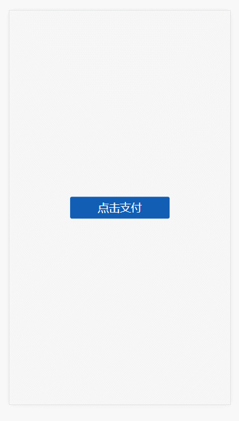

# PayBoard
PayBoard 是一个移动端ui插件，实现了支付时调用h5键盘的功能。  
(新版本已移除对于jq的依赖)。  

本插件的自适应基于淘宝移动端自适应的规范，确认html的font-size为屏幕分辨率/10;
（下版本目标，会移除对rem的依赖，用百分比替代）
#### 示例
[点击查看例子](https://luke93h.github.io/payboard.html)

<p align="center">
  
</p>

## 使用方法
###### 压缩后的代码在dist文件夹中，可自行下载并引入即可
```bash
<script src="./payboard.min.js"></script>
var board = new PayBoard() 
board.show()
```


#### 方法

* `board.show(duration)`, 显示输入框，默认200ms
* `board.hide(duration)`, 隐藏输入框，默认200ms
* `board.on(name, callBack)`，监听事件
* `board.reset()`，重置输入框
* `board.input(num)`，通过程序，输入数字，数字为0~9
* `board.delete(num)`，通过程序，删除num位数字


#### 事件
###### 通过board.on(name, callBack)来监听特定的事件
###### 每个事件可注册多个监听函数
###### 所有回调函数的this指向实例对象，部分事件的回调函数会有相应的参数传入

* `complete事件`, 输入达到6位数时，回调函数会传入6位密码
* `forget事件`, 点击忘记密码时的事件，无参
* `back事件`, 点击后退按钮时的事件，无参
* `input事件`, 点击数字键盘时的事件，参数为输入的数字
* `delete事件`, 删除事件，无参


#### 属性

* `board.inputVal`, 已经输入的密码
* `board.id`, 输入框最外层dom的id
* `board.hash`, 输入框最外层dom的id上的hash值


作者：luke  
链接：https://github.com/luke93h/payBoard  
來源：github  
著作权归作者所有。商业转载请联系作者获得授权，非商业转载请注明出处。
